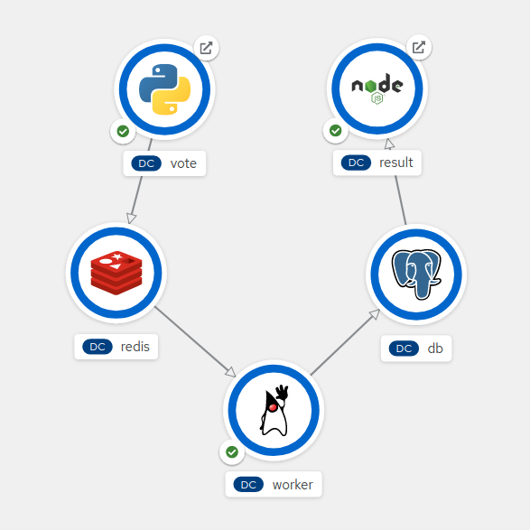
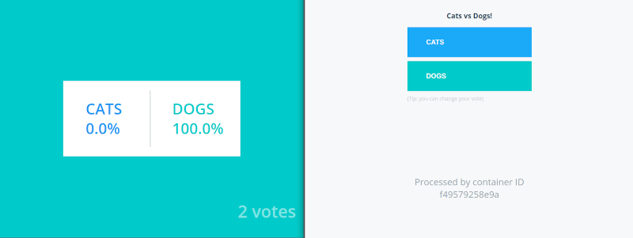
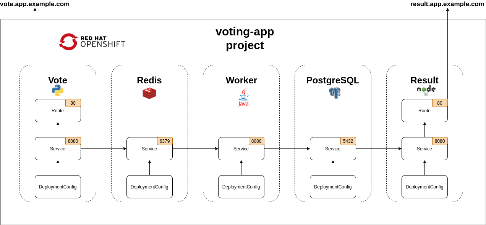

# Deploying microservices in Openshift

This project contains reworked voting application from [Docker Official Samples](https://github.com/dockersamples/example-voting-app), to be able to deploy them easily in Openshift.

## Application architecture



---

## Requirements

- An Openshift cluster up and running
- [oc CLI](https://medium.com/r/?url=https%3A%2F%2Fmirror.openshift.com%2Fpub%2Fopenshift-v4%2Fclients%2Foc%2Flatest%2F)
- [git](https://medium.com/r/?url=https%3A%2F%2Fgit-scm.com%2Fdownloads)

>I will use CodeReady Containers (crc) for this example, which is a minimal OpenShift 4 cluster able to run on your local computer. 
This could be an Openshift (version 3 or 4), OKD (version 3 or 4) or a Minishift.
At the moment, I use crc 4.6.15 and oc CLI 4.6.16.
Using git repositories allows us to keep a track of what has been done, to version all YAML files, as we can do for source code.
Using and understanding the oc CLI will make it possible to automate the creation and deployment of applications.

---

## Deploy voting-app

Before starting, if you don't know the basics of Openshift or Kubernetes, let me redirect you to the official documentation of the objects that will be used, stored and versionned:
- [Pod](https://docs.openshift.com/container-platform/4.6/rest_api/workloads_apis/pod-core-v1.html)
- [DeploymentConfig](https://docs.openshift.com/container-platform/4.6/rest_api/workloads_apis/deploymentconfig-apps-openshift-io-v1.html)
- [Service](https://docs.openshift.com/container-platform/4.6/rest_api/network_apis/service-core-v1.html)
- [Route](https://docs.openshift.com/container-platform/4.6/rest_api/network_apis/route-route-openshift-io-v1.html)
- [ImageStream](https://docs.openshift.com/container-platform/4.6/rest_api/image_apis/imagestream-image-openshift-io-v1.html)
- [BuildConfig](https://docs.openshift.com/container-platform/4.6/rest_api/workloads_apis/buildconfig-build-openshift-io-v1.html)

The last things you should know:
- Deployments may take a few minutes, the cluster needs to pull images, to build images from Dockerfile or from Source to Image.
- When your deployments are performed, you can access the result and vote application through the Openshift routes and you should see something like this:


---

## Getting started

Now, let's create an Openshift project and deploy redis and postgreSQL databases.
Connect to your Openshift cluster by using the command `oc login <SERVER_URL>` with your credentials and replace <SERVER_URL> before run any command with the oc client.

```bash
# Create voting-app project
$ oc new-project voting-app

# Allow default serviceaccount from voting-app project to run containers with any non-root user
# For the example, we will use containers running as user with uid=1001
$ oc adm policy add-scc-to-user nonroot -z default -n voting-app

# Create non persistent PostgreSQL database
$ oc process postgresql-ephemeral -n openshift \
    -p DATABASE_SERVICE_NAME=db \
    -p POSTGRESQL_USER=postgres \
    -p POSTGRESQL_PASSWORD=postgres \
    -p POSTGRESQL_DATABASE=postgres | oc apply -f - -n voting-app

# Create non persistent Redis
$ oc process redis-ephemeral -n openshift \
    -p REDIS_PASSWORD=redis | oc apply -f - -n voting-app
```

By default, there are some templates already present on your cluster.
But if you have errors and **postgresql-ephemeral** or **redis-ephemeral** are not available on your cluster, you can use templates located in openshift-specifications/templates:
```bash
# Create databases from template files
$ oc process -f openshift-specifications/templates/postgresql-ephemeral-template.yaml \
    -p DATABASE_SERVICE_NAME=db \
    -p POSTGRESQL_USER=postgres \
    -p POSTGRESQL_PASSWORD=postgres \
    -p POSTGRESQL_DATABASE=postgres | oc apply -f - -n voting-app
$ oc process -f openshift-specifications/templates/redis-ephemeral-template.yaml \
    -p REDIS_PASSWORD=redis | oc apply -f - -n voting-app
```

Initialize voting-app project with common objects for the three different ways deployment modes: 
```bash
# Deploying services, routes and imagestreams
$ oc apply -f openshift-specifications/ -n voting-app
```

What we will deploy:


### 1. With container images

First, we will deploy this with container images. These images can be built and stored in any registry.

If you want to change images, modify **image attribute** in YAML files located in openshift-specifications/with-images directory.
For example, `image: my-registry:443/my-image:1.0`.

This method is used when you have already a toolchain that build images for you and you don't want to change this operation. 

>If you want to build images and push them in a registry, you can do that as well. If you want to use images that I pushed for this article, you do not have to do anything.

Let's deploy our application:
```bash
# Deploying DeploymentConfigs with container
$ oc apply -f openshift-specifications/with-images -n voting-app
```

When the application is up and running, you can access the 2 microservices (vote and result) through the routes created for this purpose.
In my case, with application running on crc, I can access to vote app at http://vote.apps-crc.testing/ and result app at http://result.apps-crc.testing/. Take a look at the routes that Openshift has automatically created for you based on the router configuration.

### 2. With Dockerfile

In a second step, we are going to deploy the same application but with some changes: use of Dockerfile in your Git repository. It's Openshift that will take care of building our images. 
Let's update Openshift objects to try out this method and trigger container image building.
This method allows you to update your Dockerfile and source code at the same time in your SCM, you keep control over everything and it's all versioned.

```bash
# Deploying new DeploymentConfigs and BuildConfigs using dockerfile
$ oc apply -f openshift-specifications/with-dockerfile -n voting-app

# Run images build, DeploymentConfigs will be triggered when the builds are completed.
$ oc start-build result
$ oc start-build vote
$ oc start-build worker
```

Once the builds are completed, you can check vote and result application are running.

### 3. With Source to Image (S2I)

Now, what if you don't want to worry about a Dockerfile and want to stay focused on your source code? This is the last method we are going to implement.
Let's update Openshift objects again and trigger new builds.

```bash
# Deploying new DeploymentConfigs and new BuildConfigs using s2i
$ oc apply -f openshift-specifications/with-s2i -n voting-app

# Run images build, DeploymentConfigs will be triggered when the builds are completed.
$ oc start-build result-s2i
$ oc start-build vote-s2i
$ oc start-build worker-s2i
```

Once the builds are completed, you can check vote and result application are running.

## Conclusion

We have learned how to deploy applications on Openshift in several ways :
- With container image already built
- With Dockerfile from Git repository
- With Source to Image (S2I)

There are several ways to migrate applications, and there is not a best way to do that, it depends on how you want to manage your application lifecycle.
Do you already have tools that build images and store them, and you don't want to migrate everything to Openshift? Then deploy your applications using your container images.
Do you want to deploy applications from their source code? If you want to take care of a Dockerfile, choose to build your application with it. If not, Source to Image allows you to deploy already secured container images in your cluster.
There are other solutions you can implement, a combination of Dockerfile and S2I for example, or launching CI/CD pipelines with other tools and so on.
